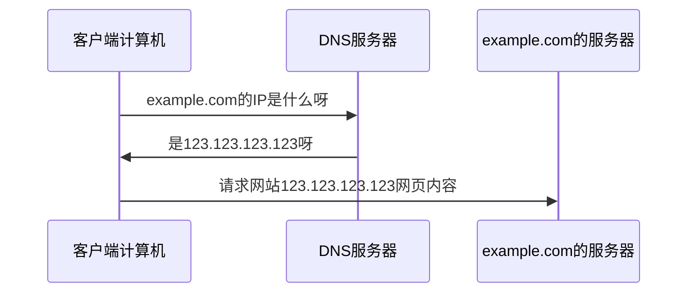
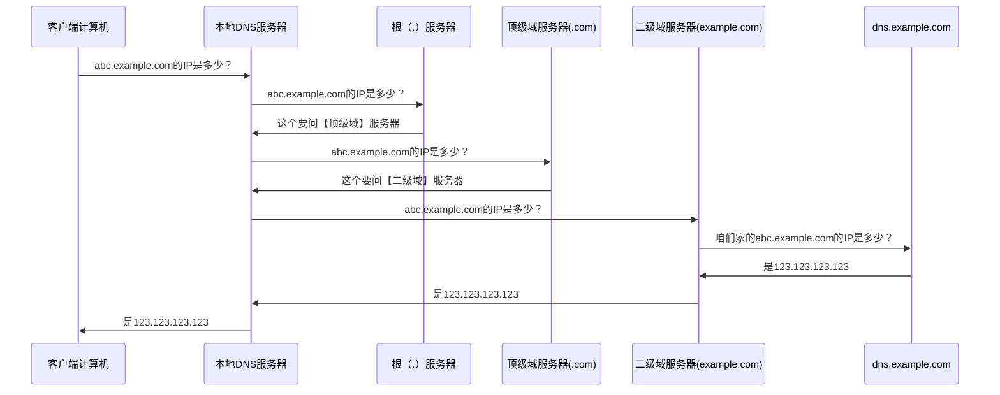

之前的文章[在家折腾局域网实录(上)](https://blog.anymelon.com/2020/05-16-play-local-network-at-home-1/)中写到过，通过家里搭建一个DNS服务器来实现 同一个域名，在局域网和互联网中对应不同IP的功能。

这激发了我的~~（创作欲望）~~研究DNS攻击的欲望，毕竟我的那一通操作实际上也就是自己劫持自己。

<!-- more -->

## 一、什么是DNS

DNS，全称`Domain Name System`，即域名系统，在OSI参考模型中的应用层（与HTTP协议同层），作用是将域名解析请求递归处理，返回IP地址（和查询路径）。

IP地址相对来说是更难记忆的，而域名更好记忆，因此绝大多数有暴露公网服务需求的服务商或个人都会选择公开域名而不是IP，用户输入域名之后，浏览器（实际上是系统）向DNS服务器发送请求来获取实际IP，再向响应IP地址发送请求。当然相应的，在服务器更换公网IP时可以不用改变域名，更有利于品牌的建立等。

不同地区的人请求相同域名得到的结果不一定是相同的，服务提供商会付费给运营商（或其他DNS服务提供商），要求在不同地区缓存不同的DNS映射信息，以达到提高该地区对服务访问的加速作用。

## 二、简单的流程

比如一个客户端计算机想要浏览域名为example.com的网站：



客户端想访问一个域名为example.com的网站的内容，首先先要知道example.com对应的IP地址，因为域名只是一个名字，不是一个有效的访问路径，它只是用来在DNS服务器的记录中找到对应IP的。获取IP就需要向DNS服务器发出请求，DNS服务器（群）查找缓存及相关记录，返回IP地址。

## 三、详细流程

DNS递归查询的流程就像翻通讯录找一个同学的电话号码一样，想知道A同学的电话号码，但是自己的通讯录（相当于缓存）中没有，就曲线救国，向B同学询问，B同学说C同学知道，然后问到C同学终于拿到了电话号码。



## 四、请求报文

本段内容主要引用了【参考文献】中的报文详解内容。

### 使用的协议

DNS和HTTP协议一样，是一种应用层协议，传输层同时使用了TCP和UDP协议，由于TCP虽然安全稳定但是速度慢开销大，UDP虽然不安全稳定但是开销小，DNS在不同用途时使用不同的协议。

DNS在进行区域传输的时候使用TCP协议，其他是会使用UDP协议。

简单讲就是：

- 在DNS服务器间传输数据时使用TCP（如：主DNS服务器和辅DNS服务器同步记录时，数据包会非常大，且对稳定性和准确性要求较高）
- 在DNS服务器与客户端计算机通信时，如果请求不会超过512字节（UDP的最大限制）时，使用UDP，超过则选择TCP（DNS服务器支持，且打开了相关配置时）

### 报文的格式

DNS报文的Request和Response使用了相同的格式：

```
  DNS format

  +--+--+--+--+--+--+--+
  |        Header      |
  +--+--+--+--+--+--+--+
  |      Question      |
  +--+--+--+--+--+--+--+
  |      Answer        |
  +--+--+--+--+--+--+--+
  |      Authority     |
  +--+--+--+--+--+--+--+
  |      Additional    |
  +--+--+--+--+--+--+--+
```

### Header 报文头

`ID`:  `2`个字节(`16bit`)，标识字段，客户端会解析服务器返回的DNS应答报文，获取`ID`值与请求报文设置的`ID`值做比较，如果相同，则认为是同一个DNS会话。

`FLAGS`: `2`个字节(`16bit`)的标志字段。包含以下属性:

- `QR(Query Response)`: `0`表示查询报文，`1`表示响应报文;

- `opcode`: 通常值为`0`（标准查询），其他值为`1`（反向查询）和`2`（服务器状态请求）,`[3,15]`保留值;

- `AA`: 表示授权回答（authoritative answer）-- 这个比特位在应答的时候才有意义，指出给出应答的服务器是查询域名的授权解析服务器;

- `TC`: 表示可截断的（truncated）--用来指出报文比允许的长度还要长，导致被截断;

- `RD`: 表示期望递归(Recursion Desired) -- 这个比特位被请求设置，应答的时候使用的相同的值返回。如果设置了RD，就建议域名服务器进行递归解析，递归查询的支持是可选的;

- `RA`: 表示支持递归(Recursion Available) --  这个比特位在应答中设置或取消，用来代表服务器是否支持递归查询;

- `Z` : 保留值，暂未使用;

- `RCODE`: 应答码(Response code) - 这4个比特位在应答报文中设置，代表的含义如下:
  - `0` : 没有错误。
  - `1` : 报文格式错误(Format error) - 服务器不能理解请求的报文;
  - `2` : 服务器失败(Server failure) - 因为服务器的原因导致没办法处理这个请求;
  - `3` : 名字错误(Name Error) - 只有对授权域名解析服务器有意义，指出解析的域名不存在;
  - `4` : 没有实现(Not Implemented) - 域名服务器不支持查询类型;
  - `5` : 拒绝(Refused) - 服务器由于设置的策略拒绝给出应答.比如，服务器不希望对某些请求者给出应答，或者服务器不希望进行某些操作（比如区域传送zone transfer）;
  - `[6,15]` : 保留值，暂未使用。

`QDCOUNT`: 无符号`16bit`整数表示报文请求段中的问题记录数。

`ANCOUNT`: 无符号`16bit`整数表示报文回答段中的回答记录数。

`NSCOUNT`: 无符号`16bit`整数表示报文授权段中的授权记录数。

`ARCOUNT`: 无符号`16bit`整数表示报文附加段中的附加记录数。

```
Header format

    0  1  2  3  4  5  6  7  0  1  2  3  4  5  6  7
  +--+--+--+--+--+--+--+--+--+--+--+--+--+--+--+--+
  |                      ID                       |
  +--+--+--+--+--+--+--+--+--+--+--+--+--+--+--+--+
  |QR|  opcode   |AA|TC|RD|RA|   Z    |   RCODE   |
  +--+--+--+--+--+--+--+--+--+--+--+--+--+--+--+--+
  |                    QDCOUNT                    |
  +--+--+--+--+--+--+--+--+--+--+--+--+--+--+--+--+
  |                    ANCOUNT                    |
  +--+--+--+--+--+--+--+--+--+--+--+--+--+--+--+--+
  |                    NSCOUNT                    |
  +--+--+--+--+--+--+--+--+--+--+--+--+--+--+--+--+
  |                    ARCOUNT                    |
  +--+--+--+--+--+--+--+--+--+--+--+--+--+--+--+--+
```

### Question查询字段

- `QNAME` 无符号`8bit`为单位长度不限表示查询名(广泛的说就是：域名).
- `QTYPE` 无符号`16bit`整数表示查询的协议类型.
- `QCLASS` 无符号`16bit`整数表示查询的类,比如，`IN`代表Internet.

```
  Question format

    0  1  2  3  4  5  6  7  0  1  2  3  4  5  6  7
  +--+--+--+--+--+--+--+--+--+--+--+--+--+--+--+--+
  |                     ...                       |
  |                    QNAME                      |
  |                     ...                       |
  +--+--+--+--+--+--+--+--+--+--+--+--+--+--+--+--+
  |                    QTYPE                      |
  +--+--+--+--+--+--+--+--+--+--+--+--+--+--+--+--+
  |                    QCLASS                     |
  +--+--+--+--+--+--+--+--+--+--+--+--+--+--+--+--+
```

### QTYPE类型

`QTYPE`协议类型. [查看详情](https://nodejs.org/dist/latest-v6.x/docs/api/dns.html#dns_dns_resolve_hostname_rrtype_callback)

协议类型对应的列表：

| 值   | 协议类型 | 描述                                       |
| ---- | -------- | ------------------------------------------ |
| 1    | A        | IPv4地址                                   |
| 2    | NS       | 名字服务器                                 |
| 5    | CNAME    | 规范名称定义主机的正式名字的别名           |
| 6    | SOA      | 开始授权标记一个区的开始                   |
| 11   | WKS      | 熟知服务定义主机提供的网络服务             |
| 12   | PTR      | 指针把IP地址转化为域名                     |
| 13   | HINFO    | 主机信息给出主机使用的硬件和操作系统的表述 |
| 15   | MX       | 邮件交换把邮件改变路由送到邮件服务器       |
| 28   | AAAA     | IPv6地址                                   |
| 252  | AXFR     | 传送整个区的请求                           |
| 255  | ANY      | 对所有记录的请求                           |

### Answer/Authority/Additional

这3个字段的格式都是一样的。

- `NAME` 资源记录包含的域名.
- `TYPE` 表示`DNS`协议的类型.
- `CLASS` 表示RDATA的类.
- `TTL` 4字节无符号整数表示资源记录可以缓存的时间。0代表只能被传输，但是不能被缓存。
- `RDLENGTH` 2个字节无符号整数表示RDATA的长度
- `RDATA` 不定长字符串来表示记录，格式根TYPE和CLASS有关。比如，TYPE是A，CLASS 是 IN，那么RDATA就是一个4个字节的ARPA网络地址。

```
  Answer/Authority/Additional format

    0  1  2  3  4  5  6  7  0  1  2  3  4  5  6  7
  +--+--+--+--+--+--+--+--+--+--+--+--+--+--+--+--+
  |                    NAME                       |
  +--+--+--+--+--+--+--+--+--+--+--+--+--+--+--+--+
  |                    TYPE                       |
  +--+--+--+--+--+--+--+--+--+--+--+--+--+--+--+--+
  |                    CLASS                      |
  +--+--+--+--+--+--+--+--+--+--+--+--+--+--+--+--+
  |                    TTL                        |
  +--+--+--+--+--+--+--+--+--+--+--+--+--+--+--+--+
  |                    RDLENGTH                   |
  +--+--+--+--+--+--+--+--+--+--+--+--+--+--+--+--+
  |                    RDATA                      |
  +--+--+--+--+--+--+--+--+--+--+--+--+--+--+--+--+
```

## 五、DIG命令

Linux/Unix中有一个`dig`命令，可以不使用系统网络链路直接请求DNS服务器，肥肠方便开发和调试DNS服务器。

比如请求`baidu.com`的DNS记录：

```
❯ dig baidu.com

; <<>> DiG 9.10.6 <<>> baidu.com @223.5.5.5
;; global options: +cmd
;; Got answer:
;; ->>HEADER<<- opcode: QUERY, status: NOERROR, id: 42515
;; flags: qr rd ra; QUERY: 1, ANSWER: 2, AUTHORITY: 0, ADDITIONAL: 0

;; QUESTION SECTION:
;baidu.com.			IN	A

;; ANSWER SECTION:
baidu.com.		410	IN	A	220.181.38.148
baidu.com.		410	IN	A	39.156.69.79

;; Query time: 3 msec
;; SERVER: 223.5.5.5#53(223.5.5.5)
;; WHEN: Sun Mar 07 22:47:15 CST 2021
;; MSG SIZE  rcvd: 59
```

以上记录的意思：

- 通过A协议得到了`baidu.com`的实际IP地址
- 有2个`ANSWER SECTION`可供选择
- 查询时间3ms
- 本地DNS服务器使用的223.5.5.5

当然也可能碰到比较绕的情况：

```
❯ dig a.example.com

; <<>> DiG 9.10.6 <<>> a.example.com @223.5.5.5
;; global options: +cmd
;; Got answer:
;; ->>HEADER<<- opcode: QUERY, status: NOERROR, id: 37741
;; flags: qr rd ra; QUERY: 1, ANSWER: 2, AUTHORITY: 0, ADDITIONAL: 0

;; QUESTION SECTION:
;a.example.com.		IN	A

;; ANSWER SECTION:
a.example.com.	60	IN	CNAME	b.example.com.
b.example.com.	60	IN	A	123.123.123.123

;; Query time: 739 msec
;; SERVER: 223.5.5.5#53(223.5.5.5)
;; WHEN: Sun Mar 07 22:51:14 CST 2021
;; MSG SIZE  rcvd: 81
```

上面结果的意思：

- 在查询`a.example.com`时，本来想问A协议的结果，A协议直接对应的IP地址
- 但是上层DNS服务器先返回了一个CNAME记录`b.example.com`
- 由CNAME记录中的`b.example.com`再查询一次，得到了最终的A协议IP`123.123.123.123`

**注意：**在实际的请求中可以发现，比如`a.example.com.`后面都会有一个点(.)，这是因为实际上`.`后面省略了`.root`后缀，域名`a.example.com.`的全程实际上是`a.example.com.root`。

### dig命令的详细解读

引用一下阮一峰的博客：

虽然只需要返回一个IP地址，但是DNS的查询过程非常复杂，分成多个步骤。

工具软件`dig`可以显示整个查询过程。

```bash
$ dig math.stackexchange.com
```

上面的命令会输出六段信息。

```
❯ dig math.stackexchange.com

; <<>> DiG 9.10.6 <<>> math.stackexchange.com
;; global options: +cmd
;; Got answer:
;; ->>HEADER<<- opcode: QUERY, status: NOERROR, id: 27597
;; flags: qr rd ra; QUERY: 1, ANSWER: 4, AUTHORITY: 4, ADDITIONAL: 1

;; OPT PSEUDOSECTION:
; EDNS: version: 0, flags:; udp: 4096
;; QUESTION SECTION:
;math.stackexchange.com.		IN	A

;; ANSWER SECTION:
math.stackexchange.com.	3600	IN	A	151.101.65.69
math.stackexchange.com.	3600	IN	A	151.101.1.69
math.stackexchange.com.	3600	IN	A	151.101.193.69
math.stackexchange.com.	3600	IN	A	151.101.129.69

;; AUTHORITY SECTION:
stackexchange.com.	86400	IN	NS	ns-1832.awsdns-37.co.uk.
stackexchange.com.	86400	IN	NS	ns-925.awsdns-51.net.
stackexchange.com.	86400	IN	NS	ns-cloud-d1.googledomains.com.
stackexchange.com.	86400	IN	NS	ns-cloud-d2.googledomains.com.

;; ADDITIONAL SECTION:
ns-463.awsdns-57.com.	  171406	IN	NS	205.251.193.207
ns-925.awsdns-51.com.	  171393	IN	NS	205.251.195.157
ns-1029.awsdns-00.com.	171469	IN	NS	205.251.196.5
ns-1832.awsdns-37.com.	171393	IN	NS	205.251.199.40

;; Query time: 48 msec
;; SERVER: 192.168.66.116#53(192.168.66.116)
;; WHEN: Sun Mar 07 23:02:29 CST 2021
;; MSG SIZE  rcvd: 252
```


第一段是查询参数和统计。

```
; <<>> DiG 9.10.6 <<>> math.stackexchange.com
;; global options: +cmd
;; Got answer:
;; ->>HEADER<<- opcode: QUERY, status: NOERROR, id: 27597
;; flags: qr rd ra; QUERY: 1, ANSWER: 4, AUTHORITY: 4, ADDITIONAL: 1
```


第二段是查询内容。

```
;; OPT PSEUDOSECTION:
; EDNS: version: 0, flags:; udp: 4096
;; QUESTION SECTION:
;math.stackexchange.com.		IN	A
```


上面结果表示，查询域名`math.stackexchange.com`的`A`记录，`A`是address的缩写。

第三段是DNS服务器的答复。

```
;; ANSWER SECTION:
math.stackexchange.com.	3600	IN	A	151.101.65.69
math.stackexchange.com.	3600	IN	A	151.101.1.69
math.stackexchange.com.	3600	IN	A	151.101.193.69
math.stackexchange.com.	3600	IN	A	151.101.129.69
```


上面结果显示，`math.stackexchange.com`有四个`A`记录，即四个IP地址。`600`是TTL值（Time to live 的缩写），表示缓存时间，即600秒之内不用重新查询。

第四段显示`stackexchange.com`的NS记录（Name Server的缩写），即哪些服务器负责管理`stackexchange.com`的DNS记录。

```
;; AUTHORITY SECTION:
stackexchange.com.	86400	IN	NS	ns-1832.awsdns-37.co.uk.
stackexchange.com.	86400	IN	NS	ns-925.awsdns-51.net.
stackexchange.com.	86400	IN	NS	ns-cloud-d1.googledomains.com.
stackexchange.com.	86400	IN	NS	ns-cloud-d2.googledomains.com.
```


上面结果显示`stackexchange.com`共有四条NS记录，即四个域名服务器，向其中任一台查询就能知道`math.stackexchange.com`的IP地址是什么。

第五段是上面四个域名服务器的IP地址，这是随着前一段一起返回的。

```
;; ADDITIONAL SECTION:
ns-463.awsdns-57.com.	  171406	IN	NS	205.251.193.207
ns-925.awsdns-51.com.	  171393	IN	NS	205.251.195.157
ns-1029.awsdns-00.com.	171469	IN	NS	205.251.196.5
ns-1832.awsdns-37.com.	171393	IN	NS	205.251.199.40
```


第六段是DNS服务器的一些传输信息。

```
;; Query time: 48 msec
;; SERVER: 192.168.66.116#53(192.168.66.116)
;; WHEN: Sun Mar 07 23:02:29 CST 2021
;; MSG SIZE  rcvd: 252
```


上面结果显示，本机的DNS服务器是`192.168.66.116`，查询端口是53（DNS服务器的默认端口），以及回应长度是252字节。

如果不想看到这么多内容，可以使用`+short`参数。

```bash
$ dig +short math.stackexchange.com

151.101.129.69
151.101.65.69
151.101.193.69
151.101.1.69
```

上面命令只返回`math.stackexchange.com`对应的4个IP地址（即`A`记录）。

## 六、报文的Buffer

可以通过以下代码配合dig命令看到DNS请求报文：

```javascript
  const dgram = require('dgram');
  const server = dgram.createSocket('udp4');

  server.on('message' , (msg , rinfo)=>{
      console.log('msg: ', msg);

  });

  server.bind({port:53,address:'127.0.0.1'});
```

比如我使用`dig baidu.com`请求，请求报文为：

```
<Buffer 7f 02 01 20 00 01   00 00   00 00   00 01   
        | ID |FLAGS|QDCOUNT|ANCOUNT|NSCOUNT|ARCOUNT|
        05 62 61 69 64 75 03 63 6f 6d 00
        05 b  a  i  d  u  03 c  o  m  结束
        00 01 00 01  00 00 29 10 00 00 00 00 00 00 00>
       |QTYPE|QCLASS|
```

其中的`FLAGS`不光可以用位运算计算，也可以直接用二进制字符串计算，比如上面的`01 20`，可以通过`(0x0120).toString(2)`得到二进制字符串：`'100100000'`，通过补位补成2字节（16bit）：`0000 0001 0010 0000`

对应关系如下：

```
 0  0000     0  0  1  0  010      0000
|QR| opcode |AA|TC|RD|RA| ZERO | RCODE  |
|0 |    0   |0 |0 |1 |0 | 2(0) | 0      |
```

正常人家的DNS FLAGS一般都是0x0100（除了RD为1其他都为0），但是我这里一直出现0x0120，至今没有研究出结果。。这里指出【参考文献】中的代码示例问题，ZERO字段不可直接取那3bit，不然保留且必为0的ZERO会显示成`2`。

这里的ZERO字段实际上只有第一个`0`用上了，虽然说好了是3bit，实际上后两个bit还另有他用，答案就在返回值中：比如返回值FLAGS为`0x8580`，同样方法转为二进制：`1000010110000000`，对应关系如下：

```
 1    0000   1      0  1  1   0      0            0              0000
|QR| opcode |Authed|TC|RD|RA| ZERO | Asw Authed | None-authed | RCODE |
|1 |    0   |1     |0 |1 |1 |   0  | 0          | 0           | 0     |
```

这里【参考文献】原文中的代码示例可能有些问题，我在实际获取Buffer后发现，`QTYPE`和`QCLASS`是紧跟域名结束的00之后的，但是不一定是最后的32bit，【参考文献】中直接用`buf[length - 4]`等方法取最后32bit，但是结尾有可能跟着一些其他的Buffer，这里有待研究。

## 七、劫持原理和防范

DNS劫持实施的途径可以是~~（潜入他的房间）~~更改被侵入者的系统设置中的DNS网络配置。

也可以是运营商、服务提供商被黑客攻击，恶意修改解析记录。

也可以是某些官方做这种勾当，他们的优势就是本身就是大家网络设备的默认DNS服务器（一般在拨号时分配）。

能干这种事的一般也就是运营商或者DNS提供商了，他们会在你的百度url结果增加后缀，还会把你的某些特定网页（也可能是特定js文件等）URL映射的IP改成他们提供的文件，从而达到向页面注入广告的目的，这种劫持比HTTP劫持对服务器的消耗更低，毕竟DNS请求频率更低，大多数系统会缓存一段时间。

防范方法主要就可以从修改系统默认的DNS服务器地址开始，改为一些更靠谱的DNS服务器地址，比如墙内的阿里DNS：223.5.5.5，以及墙外的谷歌8.8.8.8。

杭州的小伙伴着实可以借个光，223.5.5.5服务器就在杭州机房：


