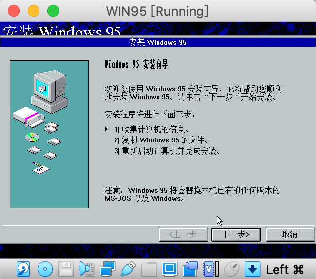
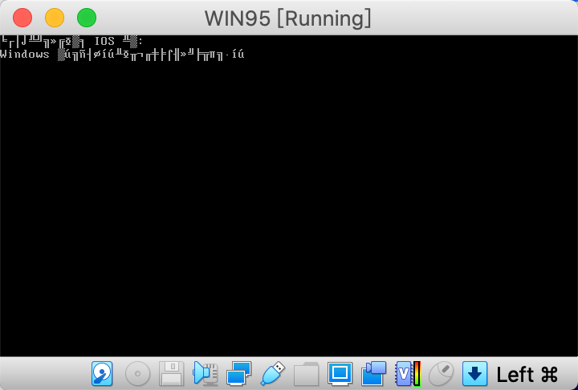
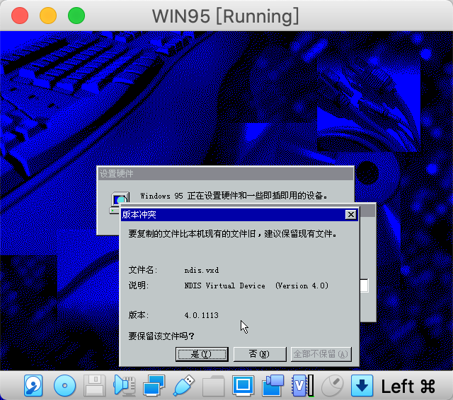
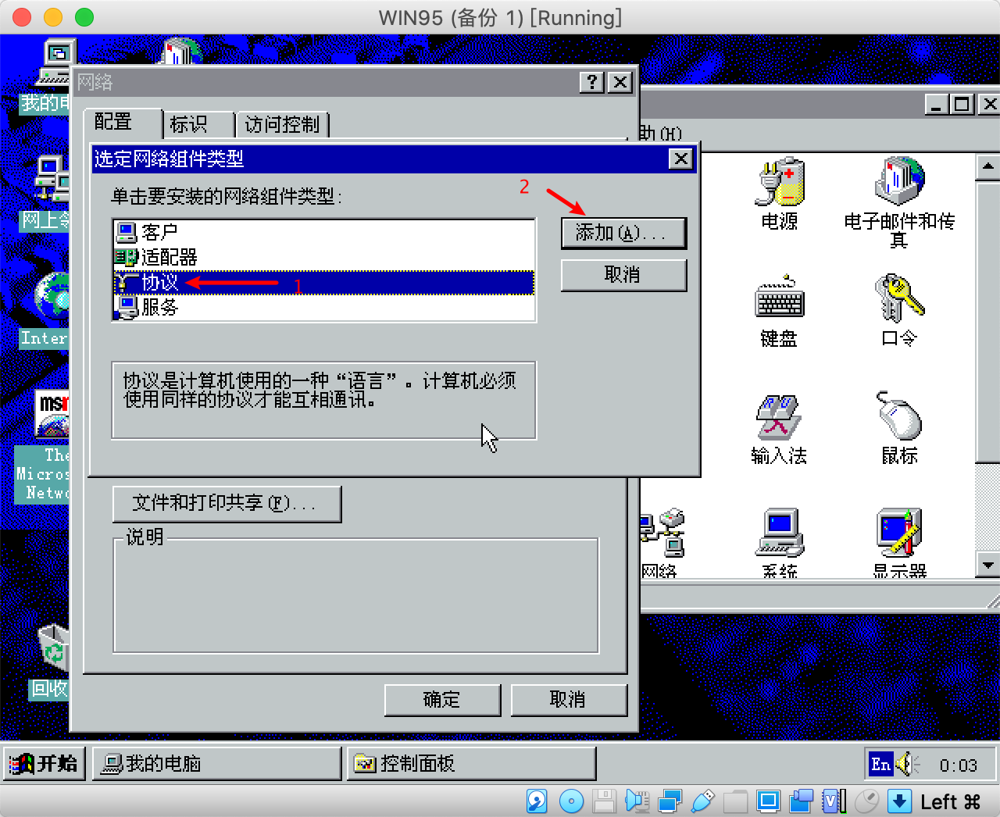

自从上次搞过WINDOWS 3.1的考古，一发不可收拾，虚拟机折腾了DOS 7.1，感觉像是回到了上个世纪。

这次由于有了上次的经验，在系统安装上简直熟悉到不行。


<!-- more -->

## 安装

这次还是用DOS 6.22做底，可以到这个网站找到相应的镜像：

https://winworldpc.com/product/ms-dos/622

喜欢自己折腾的小伙伴可以选择软盘镜像启动，因为我用的虚拟机，这里建议可以使用最底下的[Virtual PC VHD](https://winworldpc.com/download/3dc392c3-b845-18c3-9a11-c3a4e284a2ef)下载。

WIN 95镜像可以在这里下载：

https://winworldpc.com/product/windows-95/osr-3

我选择的是中文的[CD Windows 95 OSR2.1 \[Simpl. Chinese\] (OEM) (ISO)](https://winworldpc.com/download/3f5444c2-b718-c39a-11c3-a4e284a2c3a5)

喜欢英文系统的也可以用这个[Windows 95 OSR2 (OEM) (ISO)](https://winworldpc.com/download/48373a22-25c3-8911-c3a6-e280947e5254)

下载完DOS622和WIN95系统，到虚拟机（这里使用VirtualBox）新建一个虚拟机


进行上述配置之后点击创建，如果创建页面长得跟这个不一样，点击`专家模式`即可切换。

创建之后启动这个虚拟机，启动后返回VirtualBox主程序，选中刚才的虚拟机，点击`设置`，


按照上图所示点击`选择虚拟盘`，找到解压后的WIN95文件夹，找到`.iso`文件并选择，点击右下角`OK`，再回到虚拟机界面，在命令行中输入`D:`并按下回车。D盘是光驱盘，也就是我们刚刚插入的`.iso`文件。


再输入`setup`命令并按下回车


看到提示`To continue, press ENTER. To quit Setup, press ESC.`，按下回车继续。然后就进入安装界面了：


点击`继续`，


点击`是`同意协议，等待一小会，进入安装向导



点击`下一步`


再点击`下一步`


根据自己的需求选择安装模式

这里我选择了典型安装，点击`下一步`


这里需要输入序列号（SN），可以在之前的WIN95下载界面底下评论找到好心人的帮助。输入完`下一步`


输入一些个人信息并下一步


这两个看心情勾，不勾也不会影响啥，毕竟我都不确定虚拟机给的NAT在WIN95上能不能用。


然后开始读条。。。


这一步我选择了下面这个，毕竟是拿来体验的，那我就把所有功能都装上[滑稽]


反复勾选左面的勾，把白底


随意输入你的计算机名称等信息，`下一步`


选择`不需要启动盘`，点击`下一步`


直接`下一步`


等待读条


这里比较有趣的是，以当年计算机的速度，微软看起来计划的是每隔一段进度就展示一个tip，结果现在虚拟机速度都比当时电脑快，导致我每次字都没读几个就跳下一个了😹


点击`完成`


点击`确定`重启计算机


这是在设置中移除虚拟盘，在虚拟机显示界面的底部也有相应按钮


等待Windows的第一次运行，`请坐和放宽`



可能是做底的`DOS 6.22`对中文支持有问题，这里乱码了。。

这里英文显示的应该是：

```
When initializing device IOS:
Windows protection error. You need to restart your computer.
```

大概估计是因为CPU频率过高，当时电脑很多都只有0.xGHZ的频率，系统怎么也想不到会有十几倍频率的CPU过来砸场子，所以就怂了


我的CPU是i7 8700，3.19GHZ，解决方法：


先把上图的CPU运行峰值调低一些（实际使用就算是打上了FIX95CPU，也需要调低一些），不要选`启用嵌套VT-x/AMD-V`


硬件加速中取消勾选`启用嵌套分页`，如果这个勾掉但是没有打FIX95CPU补丁时，上文中的`When initializing device IOS:`会变成`When initializing device:`，很神奇

这时候就需要隆重介绍FIX95CPU这个补丁了：http://lonecrusader.x10host.com/fix95cpu.html

安装这个补丁之后，Win95就不会报上面那个错了，到网站上下载补丁，解压后在虚拟机中加载其中的ISO文件


启动后进入FIX95CPU


按任意键继续


询问是否阅读README文件，按`N`键不阅读


如果像上图一样提示，说明修复成功，**推出ISO镜像**并重启


选择`Normal`并按回车


这次就可以正常登陆了


初始化用户名和密码


重复确认密码


这时提示插入Win95的CD光盘，按之前更换光盘的步骤，换上之前的Win95安装盘







## 体验


## 总结

Win95可谓微软的“成名作”，当年微软下重金宣传，还请到了滚石乐队。在发布之时，除非置身荒岛，不然很难不知道Win95，随着铺天盖地的广告而来的，就是像现在的手机一样需要排队购买的新闻了。

Win95相对于3.x版本可以说是在GUI和功能上的重大更新了，正是因为这次大力宣传和系统的革新，奠定了微软在全球系统占有率的霸主地位。

这是我印象里最早接触的Windows系统了，四五岁的时候在爸妈单位的机房接触的最多的就是Win95，那时候它确实是个非常Popular和Fashion的系统，拥有特别多的功能。在那个年代为充满好奇心的我打开了新世界的大门，也是我对计算机兴趣的起源，在Win95中遨游，就像在时间的海洋里回溯，让我可以瞥见当初那个坐在板凳睁大眼睛乱挥鼠标的自己。